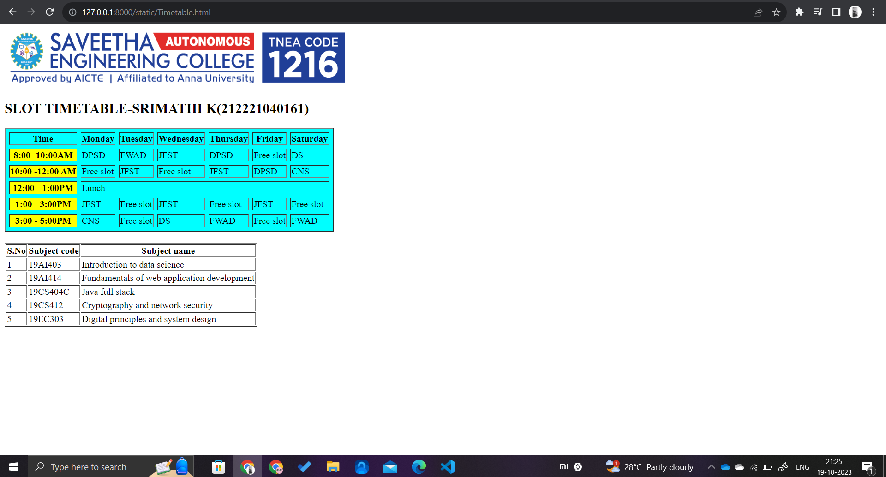

# Ex03 Time Table
Date: 10/10/2023

## AIM
To write a html webpage page to display your slot timetable.

## ALGORITHM
### STEP 1
Create a Django-admin Interface.

### STEP 2
Create a static folder and inert HTML code.

### STEP 3
Create a simple table using ```<table>``` tag in html.

### STEP 4
Add header row using ```<th>``` tag.

### STEP 5
Add your timetable using ```<td>``` tag.

### STEP 6
Execute the program using runserver command.

## CODE
```
<!DOCTYPE html>
<html lang="en">
<head>
    <meta charset="UTF-8">
    <meta name="viewport" content="width=device-width, initial-scale=1.0">
    <title>Timetable</title>
</head>
<body>
    
    
    <h2>SLOT TIMETABLE-SRIMATHI K(212221040161)</h2>

    <table cellspacing="7" bgcolor="aqua" border="2">
        <tr>
            <th>Time</th>
            <th>Monday</th>
            <th>Tuesday</th>
            <th>Wednesday</th>
            <th>Thursday</th>
            <th>Friday</th>
            <th>Saturday</th>

        </tr>
        <tr>
            <th bgcolor="yellow">8:00 -10:00AM</th>
            <td>DPSD</td>
            <td>FWAD</td>
            <td>JFST</td>
            <td>DPSD</td>
            <td>Free slot</td>
            <td>DS</td>

        </tr>
        <tr>
            <th bgcolor="yellow">10:00 -12:00 AM</th>
            <td>Free slot</td>
            <td>JFST</td>
            <td>Free slot</td>
            <td>JFST</td>
            <td>DPSD</td>
            <td>CNS</td>
        </tr>
        <tr>
            <th bgcolor="yellow">12:00 - 1:00PM</th>
            <td colspan="6">Lunch</td>

        </tr>
        <tr>
            <th bgcolor="yellow">1:00 - 3:00PM</th>
            <td>JFST</td>
            <td>Free slot</td>
            <td>JFST</td>
            <td>Free slot</td>
            <td>JFST</td>
            <td>Free slot</td>

        </tr>
        <tr>
            <th bgcolor="yellow">3:00 - 5:00PM</th>
            <td>CNS</td>
            <td>Free slot</td>
            <td>DS</td>
            <td>FWAD</td>
            <td>Free slot</td>
            <td>FWAD</td>

        </tr>
    </table>


    <table border="1" style="margin-top: 20px;">
        <tr>
            <th>S.No</th>
            <th>Subject code</th>
            <th>Subject name</th>
        </tr>
        <tr>
            <td>1</td>
            <td>19AI403</td>
            <td>Introduction to data science</td>
        </tr>
        <tr>
            <td>2</td>
            <td>19AI414</td>
            <td>Fundamentals of web application development</td>
        </tr>
        <tr>
            <td>3</td>
            <td>19CS404C</td>
            <td>Java full stack</td>
        </tr>
        <tr>
            <td>4</td>
            <td>19CS412</td>
            <td>Cryptography and network security</td>
        </tr>
        <tr>
            <td>5</td>
            <td>19EC303</td>
            <td>Digital principles and system design</td>
        </tr>
    </table>
</body>
</html>


```

## OUTPUT


## RESULT
The program for creating slot timetable using basic HTML tags is executed successfully.
